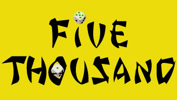

To run a frontend (HTML, CSS, JavaScript only) application in Gitpod, in the terminal, type:

python3 -m http.server

To run the webpage click on this link: <a href="https://inotila.github.io/five-thousand/index.html" target="_blank">Five thousand</a>

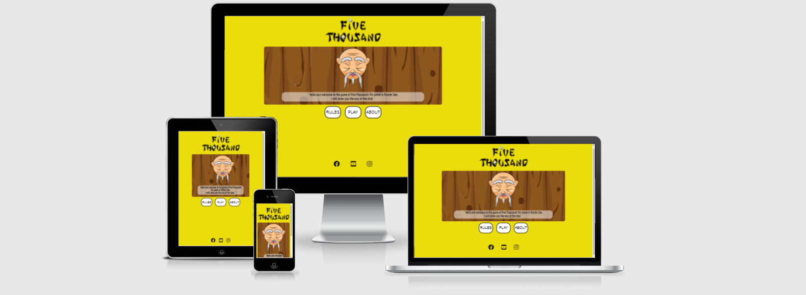

# Five Thousand (Portfolio 2)

This project is for my final submission for my second milestone. The aim of the project is to code and deploy a responsive website using Java Script, HTML and CSS. 

## About Five thousand

Five thousand is a one player dice game. The aim is to get to a score of 5000 points before the computer. The game is meant to be a quick fun game to keep users entertained for periods such when waiting in line during the bank. It should not require too much decision making however there should be a little be of strategy to keep the game interesting. 

The site owner is a game developer, and would like to offer users a simple form of entertainment. The owner would like to keep adding features to the game and updating to increase the entertainment that the user gets from the game.

The users are primarily gamers, however, the game is made simple enough to also be something non-gamers can engage with.

## Value

This game is for people who would like to play a quick an easy game that does require some strategy but also has minimal action requirements. It is a fun game, and is a great way to pass time during the commute to and from home. 

In addition, the UI is easy to understand and navigate. Furthermore, the site offers the user interaction, alerting the users on what is happening during the game, so they can better understand the consequence of their actions.

## Potential features (before starting)

1. A play zone.
2. A responsive score indicator.
3. Easy to use and understand game buttons.
4. An easy to understand rule page.
5. An about section outlining who owns the game.
6. Responsive feedback during game play.
7. Multiplayer for peer to peer game playing
8. Bonuses and punishments for specific scores.

## Actual Features (end product)
1. Welcome/home page -

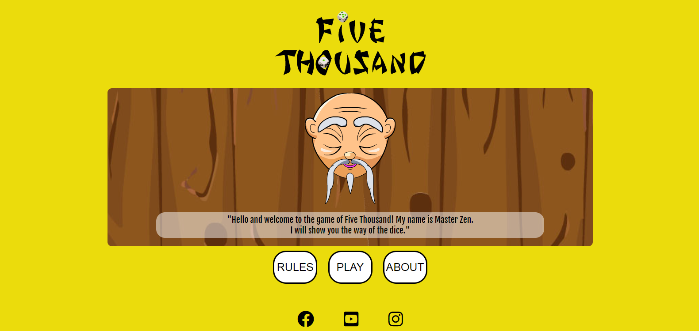

On this page the user is welcomed, and the tone/vibe of the game is set. From this page first-time users will be able to know that this is a game. 

In addition, the home page offers navigation buttons that are simply titled in order for them to easily understand what exactly it is that the button will do/take them to. 

2. Play page - 

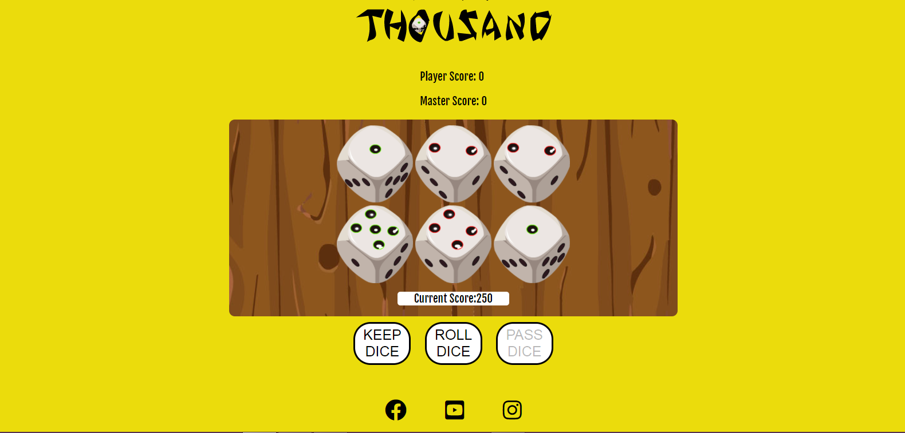

This is where the game is played. The UI is simple and users should be able to clear identify the various elements of the page.

The page has player and master score. These two elements are the total score keeper for the game. They update after every end of turn and re-set to zero when the game has come to an end. To show the increment of the score, it numbers font becomes bold for a few seconds when whoever’s turn it is has ended. 

In addition to the player and master score, there is a current score element. This keeps the score of the roll of whoever’s turn it is and re-sets to zero when their turn has come to an end. Furthermore, the current score background also switches colors to represent bonus or a zero score. I the player rolls a 500 and above the background-color becomes white. Id the player gets a score of zero, the background-color turns red. This is to give the player positive feedback when they have a bonus score, or let them know they got a bad score/zero.

The page has dice images that show exactly what the player or the CPU got on each roll. And they are displayed on a wooden background to make the user feel like they are playing on a game board.

The page also has buttons for the game play. The roll dice button is where the player rolls for his/her turn. The keep dice button is how the play increments his/her total score, and the pass dice buttons starts the CPU/other players turn.

3. Rule page - 

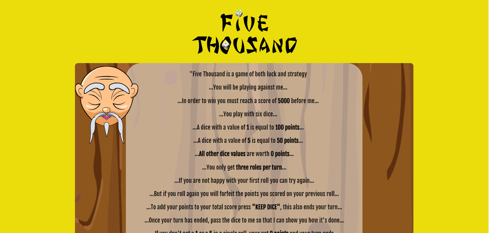

A page that has information about the rule of the game and how it is played.

In addition, the rules page offers navigation buttons that are simply titled in order for them to easily understand what exactly it is that the button will do/take them to. 

4. About page - 

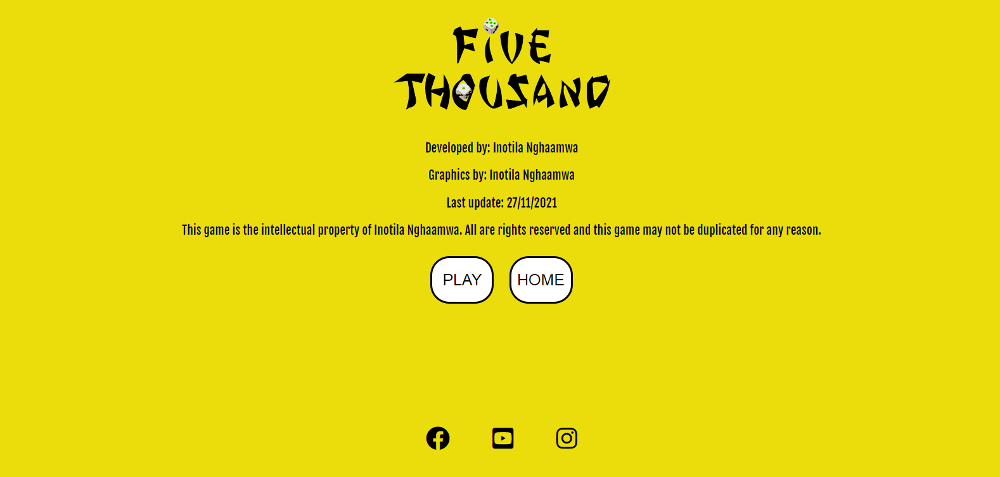

A page that has information about the games developer. And clearly states that copying this game is not permitted, as it is an original game by the developer.

In addition, the about page offers navigation buttons that are simply titled in order for them to easily understand what exactly it is that the button will do/take them to. 

4. Responsive feedback -

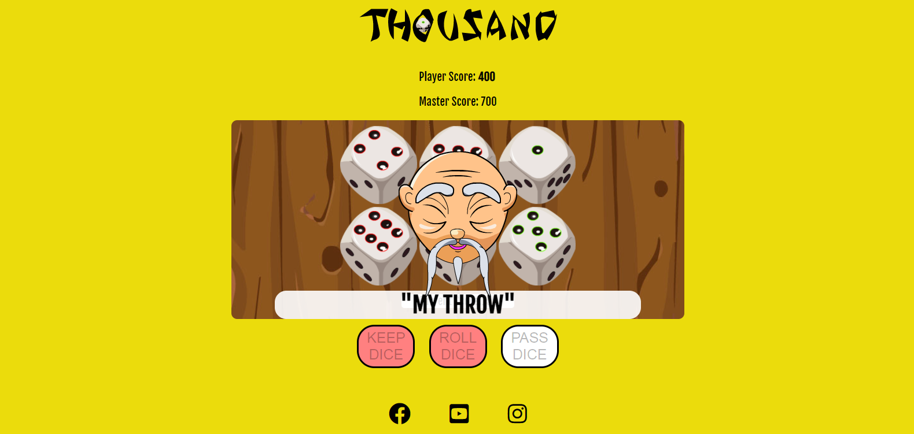

All the buttons on the page have a hover feature that turns them green. However, most of the responsive features are found in the play page, some of these have already been mentioned in the above text. In addition to those that have already been mentioned, there is a pop-up to indicate who's turn it is. There is also a winner popup to show that the game has ended and announces the winner. The winner announcing popup also give the user an option to play again or return home. These features make the user feel less isolated.

5. Logo - 

A nice logo that also serves as a home button.

6. Footer and social media links-

A footer to keep social media links. These links are links that open in new tabs so as to not take the user away from the website.

The social media links are useful for the users because they encourage the user to get in contact with the developer on other platforms (Facebook, Instagram and YouTube).

## Future Features
1. Multiplayer
2. Pick character/avatars
3. More bonuses and point scoring features
4. Online multiplayer
5. More sound effects for responsiveness
6. More options on winning conditions, e.g. play to 10 000
7. More gameplay variations

## Testing
I tested if this page works in different browsers.

I ensured that the project is responsive, and the design looks good by using a minimalist approach. In addition I used the DevTools to confirm that all devices maintain a good and structured design.

I ensured that the page is readable, and that it is easy to understand the page and the actions that are afforded to the user by links and buttons.

I have confirmed that all my inputs and fields work and accept the correct data format.

I have confirmed that all links work, and all images open.

## Bugs and fixes

Background-color -
The background color of the current score indicator wouldn't change to green when the score was above 1000. W

Point’s calculation -
When the points are above 500 or 1000 the function only counts the 3 values that make up the bonus, however if there are additional  similar values in the array after the 3 have been calculated they do not get incremented. So for example, if you roll five 1s you should score 1200, but the score will only be 1000.

Apple device display-
The text in the buttons and other elements were displaying out of place on apple devices.

### Solved bugs

To fix the background-color issue on the current score indicator, i simply moved it out of the function it was in and placed in the parent block scope of the scope that it was in.

The apple devices were displaying out of place elements because Safari has a different agent-sheet to chrome, so to off-set them I simple targeted them and made them zero. For example the buttons text where out of place because the padding was 2em on safaris agent-sheet to I made the padding 0px.

## Unfixed bugs

Unfortunately I never managed to fix the points calculation, as it seems to be above my know how at this current time. But it doesn't generate an error, and most people will not notice it. 

## Validator testing

Html - No errors returned from the official w3c validator

CSS - No errors returned from the official (jigsaw) validator

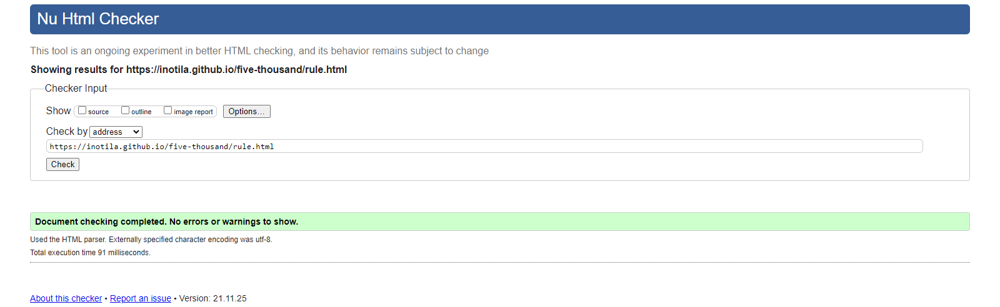

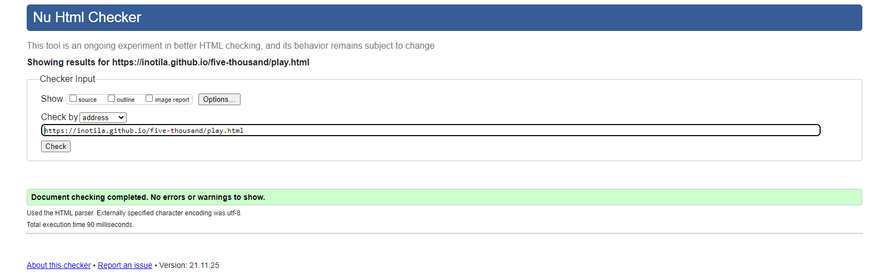

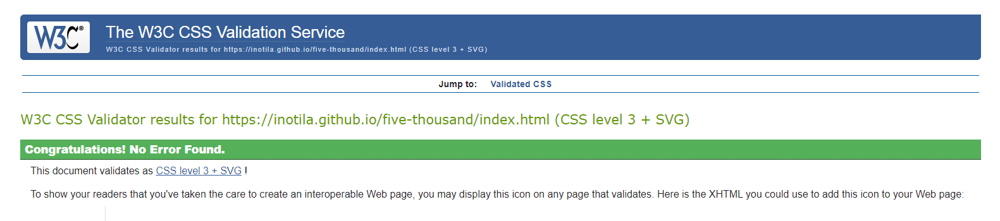

Accessibility - Confirmation that the colors content is easy to read and the sight is accessible  by running it through lighthouse in DevTools.

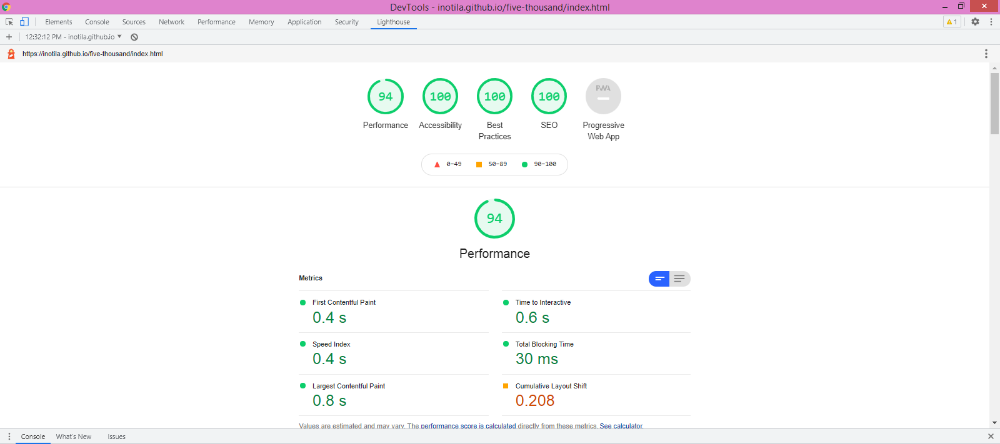

Furthermore, I have ran my JavaScript file through jshint and have no major issues apart from ES6 warnings. No errors are reported in the DevTools either.

## User testing and feedback

Ten users tested this project. I sent them the link and gave them tasks to perform, with follow up questions. This process was repeated at least twice with some of the users throughout the development of the game. 

The feedback was largely positive, the users found the graphics and the UI enjoyable. They felt the page was easy to understand and navigate. They also felt the game was well explained and easy to play. They felt the page responded to their actions exactly as they expected

Through user testing various features were added, for example, some users felt uncertain about whose turn it was to play. This led to the addition of the turn indicator that pops up after every turn. Users also felt that they needed more indication of having played, this was prior to the addition of the sound clip. 

Users, some users did mention they felt the game dragged out and that the game play could be boring as they only had three buttons to play. In addition some users felt they had little control over the games out. 

There were numerous requests for an online multiplayer option so that users could play with their friends. In addition some users said they would to be able to adjust what the winning condition is.

Overall, the users felt that the page acted as expected and they enjoyed the game. There were a few issues that needed to be addressed, some have been addressed, however the rest will be addressed in future updates as they are not important for this milestone. 

## Deployment
This project has been deployed on GitHub pages. The live link to project is: <a href="https://inotila.github.io/five-thousand/index.html" target="_blank">Five thousand</a>
The steps to deploy this project are:

From the GitHub repository navigate to the settings option.

Select the Main Branch, from the source section.

And after selecting the Main Branch, provide the link to the website.

## Credits/Reference 
This work is the original work of Inotila Nghaamwa, however the following resources were used to supplement:

### Code
I used similar coding approaches to that which was used for the love maths run-through. Particularly the event listeners. Furthermore, i used the social media links from the love-running run-through and made a few small changes to it. 

### Media
All images used are the property of Inotila Nghaamwa, I created them images using adobe software. The sound clip used was downloaded on a site that offers free sound clips.

### Credits 

Content -
Text-Written by Inotila Nghaamwa.

Images - All images used are the property of Inotila Nghaamwa.
